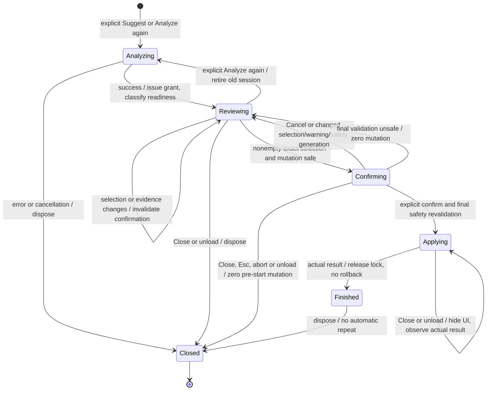

# Issue #71 — Manual Tag Apply responsibility separation

## Decision and authority

AI suggestion correctness is **advisory**. Explicit user selection and
confirmation are **intent authority**. Mutation safety remains **strict**.
Same-source content change is distinct from source change: it can produce a
warning without prohibiting Apply. STALE and UNKNOWN never independently
authorize or prohibit mutation. Missing current duplicate safety does prohibit it.

This is an architecture contract for separately approved follow-up work, not
an implementation or evidence that a general safe write strategy exists.
Production behavior change in this Issue is **0**: existing checks, services,
read-only UI, dependencies, privacy documentation and mutation APIs stay intact.

Authoritative inputs checked on 2026-10-02 JST:

- [Issue #71](https://github.com/taichocop/jevault/issues/71) and its
  [explicit human approval](https://github.com/taichocop/jevault/issues/71#issuecomment-5947854582),
  plus the human's architecture-only execution request.
- Remote latest main after fetch: `72be0fe97aee72f782f4d3b0fadc8110cf638b1c`;
  initial detached HEAD equals main, working tree clean. Architecture branch:
  `codex/issue-71-tag-apply-architecture`.
- [#68](https://github.com/taichocop/jevault/issues/68) is open and explicitly
  implementation-blocked by #71/core migration.
  [#69](https://github.com/taichocop/jevault/issues/69) is closed / not_planned;
  [PR #70](https://github.com/taichocop/jevault/pull/70) is closed / unmerged.
- [#60](https://github.com/taichocop/jevault/issues/60) /
  [PR #61](https://github.com/taichocop/jevault/pull/61),
  [#62](https://github.com/taichocop/jevault/issues/62) /
  [PR #63](https://github.com/taichocop/jevault/pull/63),
  [#64](https://github.com/taichocop/jevault/issues/64) /
  [PR #65](https://github.com/taichocop/jevault/pull/65), and
  [#66](https://github.com/taichocop/jevault/issues/66) /
  [PR #67](https://github.com/taichocop/jevault/pull/67): Issues closed/completed,
  PRs merged. #67's final approved selected-vs-selected duplicate prevention is
  retained, including its human-approved disposition of the contrary review.
- [AGENTS](AGENTS.md), [LOOP](agent/LOOP.md), [REVIEW](agent/REVIEW.md),
  [STOP](agent/STOP_CONDITIONS.md), [PR review loop](agent/PR_REVIEW_LOOP.md),
  [Issue #64 report](ISSUE_64_SPIKE.md), relevant
  [README](README.md#read-only-tag-suggest) / [PRIVACY](PRIVACY.md), and current
  production boundaries below. There is no `docs/` tree. The root-level
  `ISSUE_64_SPIKE.md` convention determines this record's location/name.

#71 supersedes evaluation-equality-as-general-eligibility in predecessor
Issues and #68's original body. It does not supersede exact source, exact
selection, duplicate, preservation, cancellation or concurrency requirements.
README/PRIVACY still describe today's runtime accurately; update them only
when a later implementation actually changes runtime contracts.

## Current production responsibility inventory

The [suggestion service](src/tags/tag-suggestion-service.ts) freezes the actual
provider input, captures opaque evaluation provenance before evaluation, and
returns exact suggested names. The [command](src/tags/tag-suggestion-command.ts)
starts preparation before evaluation, prepares once after success, and
transfers session ownership to the read-only
[modal](src/tags/tag-suggestion-modal.ts). Failure/cancel disposes immediately;
Close/Retry/unload disposes the old session; late work cannot restore it.
[main.ts](src/main.ts) wires dependencies and lifecycle only. Apply is not wired
to the user flow. Existing-tag display annotations are not mutation evidence.

| Current check | Current purpose | New architecture role | Keep / move / remove later |
| --- | --- | --- | --- |
| Evaluation content fingerprint / `sameContent()` | Requires evaluated content to equal indexed event data before authorization | Advisory comparison of evaluated vs observed content | Move evaluation comparison to freshness; remove it from mutation eligibility only after independent safety exists |
| Revision mtime/size | Evaluation revision equals capture/current/callback revision; conservatively rejects edits | Separate evaluation observation from short-lived mutation-generation invalidation | Remove evaluation-to-current equality as blocker later; keep current safety-generation guards; stat equality is never content/version proof |
| `MetadataCache.changed(file, data, cache)` proof | Pairs copied tag metadata with event-content fingerprint, requires evaluation match | Candidate current tag-state evidence independent of evaluation | Keep event pairing; move evaluation comparison outward; establish currency separately |
| Metadata proof object equality | Rejects new event/proof even with equal tag sets; pending new hash invalidates old record | Reject obsolete mutation-generation evidence across preparation/start/callback | Keep against current mutation candidate, not original evaluation authorization |
| `sameTags()` | Exact unordered set equality for all tags and frontmatter tags, including case-only changes | Detect candidate/callback state drift, independently of semantic duplicate identity | Keep exact comparison; allow a new candidate to capture newly proven current tags; do not compare forever to evaluation-era tags |
| Exact source identity | Original NoteSource, original TFile, captured path, Markdown/name/basename checks | Hard target boundary at every operation/transaction boundary | Keep; content edit cannot replace this check |
| `allowedTags` exact membership | All selected strings must be displayed authorized names; forged/cross-Vault authorization rejected | Issued grant defines maximum intent; check every selection before dedupe | Keep exact membership and issuance/Vault/lifetime binding |
| Semantic duplicate filtering | ASCII case equivalence against existing tags and planned additions; first selection retained | Hard additive-only duplicate boundary using proven current state | Keep #66/#67 helper; no authorization expansion or invented Unicode equivalence |
| Callback frontmatter validation | Current parsed tags match authorization; unsupported property rejects | Current transaction representation/preservation and candidate consistency | Keep and bind to current mutation evidence; not suggestion freshness |
| Shared Vault/path/TFile lock; abort checks | Same-source applies cannot overlap; pre-start abort has 0 mutation calls | Mutation execution safety, independent of grant/freshness | Keep across instances and all future strategies; release in finally |

[Authorization capture](src/tags/tag-apply-authorization.ts) currently validates
evaluation revision, calls evaluation-bound metadata `snapshot`, copies/freeze
allowed/existing/frontmatter tags, and registers authorization in a Vault-bound
WeakMap. [Tracker](src/tags/indexed-tag-metadata.ts) already records latest
target event data independently; its **snapshot acceptance** is evaluation-bound.
It also captures stat at event receipt, rejects changed stat and stale async
completion, and clears records on disposal. Neither event receipt stat nor
matching fingerprint independently pins the later whole current body.

## Current versus new concern matrix

| Concern | Current architecture | New architecture |
| --- | --- | --- |
| AI suggestion validity | Evaluation-content equality is hard eligibility | Advisory freshness; correctness still user's judgment even when CURRENT |
| User confirmation | Future UI concern; current core has no confirmation token | Required intent authority bound to visible grant and exact selection |
| Source identity | Hard original object/path | Hard original object/path, same-path replacement rejected |
| Selected authorization | Hard exact allowed membership | Hard exact grant membership before any semantic filtering |
| Duplicate prevention | Hard evaluation-bound metadata + ASCII filter | Hard current tag-state evidence + unchanged ASCII filter |
| Frontmatter/content preservation | Current object callback; additive writes only | Hard current transaction preservation; no lossy rewrite |
| Evaluation fingerprint | Mutation proof component | Optional advisory freshness candidate, never write permission |
| Changed-event metadata | Event tags accepted only when evaluation matches | Current mutation-state proof candidate with independent currency gate |
| Content edit | Revision/content/proof mismatch blocks | Freshness warning; may invalidate current safety evidence requiring new evidence |
| Same-path replacement | Blocker even if content equal | Blocker even if content/stats equal |

## Recommended domain contract

Choose **orthogonal freshness and mutation readiness**, with a separate issued
grant and confirmation. A single READY/STALE/UNSAFE enum hides CURRENT+unsafe,
UNKNOWN+safe, and stale+unsafe combinations. Those distinctions determine
warnings, intent and safe failure reasons. UI labels are derived projections.

The following TypeScript is a design sketch only; no production types are added.
Opaque brands require private issuance registries and frozen copied values at
runtime: TypeScript `readonly`/brands alone do not enforce authority in JavaScript.

```ts
declare const grantBrand: unique symbol;
declare const candidateBrand: unique symbol;
declare const confirmationBrand: unique symbol;

interface TagSuggestionGrant {
  readonly [grantBrand]: true;
  readonly source: NoteSource;
  readonly allowedTags: readonly string[];
  readonly evaluationProvenance?: EvaluationProvenance;
}

type SuggestionFreshness =
  | { readonly status: "current" }
  | { readonly status: "stale"; readonly reason: "observed-content-differs" }
  | { readonly status: "unknown"; readonly reason:
      "comparison-unavailable" | "observation-invalidated" };

type MutationBlocker =
  | "source-changed" | "source-replaced" | "invalid-selection"
  | "unsupported-frontmatter" | "duplicate-state-unverified"
  | "mutation-state-changed" | "confirmation-required"
  | "busy" | "cancelled-before-start" | "session-closed"
  | "unexpected-safe-failure";

interface MutationSafetyCandidate {
  readonly [candidateBrand]: true;
  // Private registry: Vault, session, grant/source, current revision,
  // current content-bound metadata proof/generation and copied exact tag sets.
}

interface TagApplyReadiness {
  readonly grant: TagSuggestionGrant;
  readonly selectedTags: readonly string[];
  readonly freshness: SuggestionFreshness;
  readonly mutation:
    | { readonly status: "safe"; readonly candidate: MutationSafetyCandidate }
    | { readonly status: "unsafe"; readonly reason: MutationBlocker };
}

interface ConfirmedTagApplyIntent {
  readonly [confirmationBrand]: true;
  // Private registry: exact grant, copied selected names/order,
  // shown warning generation and reviewed mutation candidate generation.
}

interface ConfirmedTagApplyRequest {
  readonly grant: TagSuggestionGrant;
  readonly selectedTags: readonly string[];
  readonly confirmation: ConfirmedTagApplyIntent;
  readonly candidate: MutationSafetyCandidate;
}
```

Grant issuance uses only a successful, validated suggestion outcome, never
arbitrary caller strings. Bind it to the original **outcome.source instance**,
its original TFile/path, Vault and operation lifetime; do not manufacture a new
source from the active note. Copy/freeze exactly the displayed suggested names
(exact duplicates may collapse without expanding the set). No free-form names.
Missing metadata proof or evaluation provenance cannot discard this grant;
missing provenance makes freshness UNKNOWN, not selection unauthorized.

Allowed `#aws` does not authorize selected `#AWS`. If both are allowed and
selected, authorize **both first**, then dedupe with #67's ASCII-only helper,
retaining first selected representation/order. Hierarchical parents/children
remain distinct; no NFC/NFD/locale folding is invented.

`safe` means current safety requirements were established at the observation
boundary, with a candidate for mandatory revalidation; it is not an enduring
write permission. Confirmation alone cannot make an unsafe candidate safe.
Only the mutation service, after confirmation, lock acquisition and current
transaction validation, may perform a write. Empty selection is a zero-write
no-change path; the UI disables Apply for it. All-present selections also
produce no-change after valid current-state checks.

UI receives exact source path/selected names for confirmation and a sanitized
readiness view. The owning session retains grant/candidate/confirmation handles;
metadata proof, provenance internals, body and digest never enter rendered
copy, serialized presentation, settings, logs or telemetry.

## Freshness and EvaluationProvenance

| Advisory state | Evidence/meaning | UX/Apply effect |
| --- | --- | --- |
| CURRENT | A valid original-target observation compares equal to evaluated exact content | No freshness warning; not proof of AI correctness or later transaction safety |
| STALE | A valid same-original-target content observation differs from evaluation | Warn and permit confirm only when independently mutation-safe |
| UNKNOWN | No provenance/comparison, failed crypto, or invalidated observation | Explain uncertainty and permit confirm only when independently mutation-safe |

EvaluationProvenance retains its existing exact UTF-16 SHA-256 opaque,
memory-only comparison role, under the existing cryptographic assumption.
Move its **evaluation match** out of mutation authorization. Keep source
association and evaluated input immutable. It has no authority to expand a
grant or assert current inline absence. Its evaluation revision is historical
context, not a lock. Equal mtime/size never yields CURRENT on its own; a stat
change alone does not prove different content. A changed-and-restored exact
body may compare CURRENT at the new observation; this says nothing about edits
throughout the intervening interval.

The classifier needs a valid target observation (event data or a separately
approved target-only read) and rejects obsolete async results by generation.
An old/delayed event is not an unconditional claim about current disk/editor
content. If currency of the advisory observation cannot be determined, use
UNKNOWN. A separate read proves only its sampled string, never locks a future
write. No new production reads are approved by this record; #60's current
no-body-read Apply behavior remains until separately approved migration.

## Changed-event proof: new role and unresolved safety boundary

Operation-scoped latest **original target** tracking can retain a copied
`data/cache` event pair even if `data != evaluation content`. Redefine the
provider to obtain current metadata evidence without an evaluation parameter;
the freshness classifier separately compares content tokens.

| Event relationship | Advisory candidate | Mutation-state evidence |
| --- | --- | --- |
| data matches evaluation | CURRENT if observation valid | cache is bound to that indexed data; currency still required |
| data differs from evaluation | STALE if observation valid | cache is bound to different indexed data; may support current duplicate safety |
| No accepted event / hash pending / helpers failed | UNKNOWN unless other valid advisory observation | No usable current duplicate proof; unsafe |
| Prior event survives a newer write or delayed index | UNKNOWN or known STALE from other valid observation | Old pair is not current proof, even if tags/stat/proof object look unchanged |

This **separation is viable as a responsibility design**. It does not by itself
solve event-to-write currency. Proof of `cache belongs to event data` is
different from proof of `event data belongs to current transaction content`.
Proof object equality detects tracker-generation changes; it cannot detect
an edit whose notification has not arrived. mtime/size are invalidation guards,
not collision-free content/version tokens. Jevault's lock excludes Jevault
concurrent applies, not editors or OS writes.

Required before any candidate is exposed as mutation-safe:

1. Exact source/Vault/session identity and valid current generation.
2. Trusted, immutable tag interpretation bound to the accepted target content,
   with all relevant current inline and frontmatter tags covered.
3. Public-contract evidence that this tag state remains valid for the actual
   mutation boundary, plus current callback frontmatter validation.
4. Invalidation of pending/obsolete proofs on target changes and disposal;
   no async old completion revives them. Preserve target-only filtering before
   helpers/hashing; no session replay, polling or proof-refresh writes.

**General processFrontMatter eligibility for the redesigned model is NOT
VERIFIED.** Its callback supplies current frontmatter but no whole-body/version
token; an independently changed inline tag can evade frontmatter comparison.
Counterexample: old pair has no selected inline tag; body acquires that tag,
event/stat delivery lags (or stats equal), callback frontmatter is unchanged.
Evaluation freshness being advisory does not fix this duplicate risk.
Removing evaluation coupling alone is therefore insufficient to publish `safe`.

Until a documented transaction/content binding or equivalent false-negative-free
current duplicate proof is established, return `duplicate-state-unverified`
and preserve read-only review for the affected note. This may apply to CURRENT,
STALE or UNKNOWN alike, including unchanged pre-indexed notes without replay.
No requirement relaxation, custom general Markdown parser, private API,
background hashing, fixed polling, or restricted fallback is approved here.
Future safety investigation can succeed by recording the gap and keeping unsafe;
it must not promise that all same-source stale notes become applyable.

## Frontmatter mutation contract

Current [TagApplyService](src/tags/tag-apply-service.ts) re-resolves source and
revision before API start and in the callback, compares callback parsed tags,
then revalidates metadata tag sets/proof before assigning only `frontmatter.tags`.
Absent tags append a list; array entries are copied verbatim; scalar parsing
delegates to the official helper; unknown scalar/other shapes throw sanitized
failure. It strips only the added tags' leading persistence `#`, not casing,
hierarchy or Unicode. This describes current code, not a general YAML validity
claim: array values are currently preserved, not comprehensively validated.

| Current safeguard | Future hard requirement |
| --- | --- |
| Preserve existing frontmatter values/array entries | Keep values/representations, without normalization or removal; supported scalar conversion preserves official tag semantics |
| Preserve unrelated fields/body | Only additive tags change; Obsidian owns frontmatter serialization; no custom lossy whole-content rewrite |
| Unknown tags property throws | Unsupported representation fails closed before any assignment |
| Parsed callback frontmatter tags match expected tags | Compare with the reviewed current mutation candidate, not evaluation-era tags |
| Source/revision revalidation | Original TFile/path/Markdown remains hard; compare current safety revision/generation, not permanently evaluation revision |
| Metadata snapshot/proof revalidation | Keep current mutation evidence through actual transaction; an unchanged proof object alone is insufficient |
| One API call for multiple additions | Keep one validated additive mutation; none for no actual additions |

Preservation is of existing values and unchanged body, not a promise that
Obsidian preserves YAML whitespace/key formatting. Never claim a failed
post-start write guarantees zero disk changes; sanitize uncertainty and avoid
automatic retry/custom rollback. Pre-start cancellation means zero mutation
API calls. Once the API starts, return the actual outcome even if the owner
closes/unloads, suppress late UI, and release locks in finally.

## State machine and intent lifecycle



Within Reviewing/Confirming the orthogonal projection is:

| Mutation | Freshness | UI projection | Confirm/Apply |
| --- | --- | --- | --- |
| safe | current | READY | Explicit confirm allowed |
| safe | stale | STALE_SUGGESTION | Warning then explicit confirm, or optional Analyze again |
| safe | unknown | UNKNOWN_FRESHNESS | Uncertainty warning then explicit confirm, or optional Analyze again |
| unsafe | any | UNSAFE_TO_APPLY | Suggestions reviewable; no write |

Selection is never confirmation. Confirmation shows original Vault-relative
target path, exact selected names and applicable warning. The owner issues a
single-use confirmation only after the user acknowledges that screen. Changing
grant, selection, warning or reviewed mutation generation invalidates it.
An observed edit during confirmation refreshes readiness; if evidence is safe,
the user may confirm again without re-analysis. A changed warning discovered
at final validation returns to confirmation, never silently bypasses it.
Unobserved races must still be handled by the strict transaction safety gate.
Busy is transient and does not invalidate the grant; no automatic retry.

Analyze again is the user's option to obtain suggestions for current content,
not a required freshness-proof workaround. It retires old grant/intent/proofs,
disposes the old session, and explicitly starts a new evaluation. Never claim
it guarantees mutation evidence: the new note can still lack an indexed pair.
Do not default it to another active note from the old result: resolve and
evaluate the original target or explain that a new explicit Suggest is needed.
This target-specific orchestration needs separate approval; the current
suggestForActiveNote command is not changed here.

## Sequences (future conditional paths)

Both success sequences assume the unresolved transaction safety gate has been
established for the target by later approved work. They do not certify today's
processFrontMatter/event pair as a general current-body proof.

```mermaid
sequenceDiagram
  actor User
  participant Suggest as Tag Suggest
  participant Grant as Grant issuer
  participant Fresh as Freshness classifier
  participant Safety as Mutation safety
  participant Confirm as Confirmation owner
  participant Apply as TagApplyService
  participant Obsidian
  User->>Suggest: Explicit Suggest (capture original target)
  Suggest->>Obsidian: Target-only operation tracking + evaluated input
  Suggest->>Grant: Successful exact displayed suggestions + source
  Grant-->>Confirm: Issued read-only grant
  Suggest->>Fresh: Evaluation provenance + valid target observation
  Fresh-->>Confirm: CURRENT
  Obsidian-->>Safety: Current content-bound tag evidence
  Safety-->>Confirm: Safe candidate (independent of evaluation equality)
  Confirm-->>User: Visible suggestions
  User->>Confirm: Select exact suggested names
  Confirm-->>User: Target path, selected names, explicit confirmation
  User->>Confirm: Confirm
  Confirm->>Apply: Grant + selected names + confirmed intent + candidate
  Apply->>Apply: Lock; exact source/selection/intent; final cancel check
  Apply->>Obsidian: One mutation with current transaction validation
  Obsidian-->>Apply: Actual result
  Apply-->>Confirm: Sanitized outcome; release lock
```

```mermaid
sequenceDiagram
  actor User
  participant Suggest as Tag Suggest
  participant Grant as Grant issuer
  participant Fresh as Freshness classifier
  participant Safety as Mutation safety
  participant Confirm as Confirmation owner
  participant Apply as TagApplyService
  participant Obsidian
  User->>Suggest: Explicit Suggest original note
  Suggest->>Grant: Successful displayed tags + exact source
  Grant-->>Confirm: Grant (not mutation permission)
  User->>Obsidian: Edit same original note
  Obsidian-->>Fresh: Valid different-content observation
  Fresh-->>Confirm: STALE
  Obsidian-->>Safety: New data/cache pair + established transaction binding
  Safety-->>Confirm: New current mutation candidate is safe
  Confirm-->>User: Suggestions + note-changed warning + Analyze again option
  User->>Confirm: Select exact suggestions; explicitly confirm warning/path/tags
  Confirm->>Apply: Same grant + selection + new candidate + confirmed intent
  Apply->>Apply: Shared lock; revalidate identity/selection/intent/cancellation
  alt Current mutation evidence remains valid in transaction
    Apply->>Obsidian: One additive mutation; preserve current frontmatter/body
    Obsidian-->>Apply: Actual result
    Apply-->>Confirm: Sanitized outcome; release lock
  else Duplicate/target/intent safety cannot be established
    Apply-->>Confirm: Hard blocker; no tag assignment; release lock
  end
```

## Hard blocker taxonomy (not freshness reasons)

| Reason | Meaning / response |
| --- | --- |
| source-changed | Missing, renamed/moved, invalid path/name/Markdown or identity context; do not retarget |
| source-replaced | Original path resolves to another TFile, even with equal content/stats; reject |
| invalid-selection | Unissued/cross-Vault/expired grant or any exact selected name outside allowed set; reject before dedupe |
| unsupported-frontmatter | Current tags representation cannot be preserved/interpreted safely; no assignment |
| duplicate-state-unverified | No current transaction-bound inline/frontmatter tag proof, including missing/pending/obsolete metadata; read-only |
| mutation-state-changed | Reviewed current candidate's revision/proof/exact tags changed during validation; recapture only if independently safe, then reconfirm |
| confirmation-required | No valid explicit intent, changed selection/warning/generation, or consumed confirmation; no mutation |
| busy | Same Vault/path/TFile mutation in flight; no second write |
| cancelled-before-start | Owner abort/Close/Esc before mutation API call; zero mutation calls |
| session-closed | Disposed lifetime; no proof/confirmation revival |
| unexpected-safe-failure | Sanitized unexpected capture/validation/API error; no raw details or assumed post-start zero-write guarantee |

Legacy `freshness-unverified` splits into advisory UNKNOWN **and independently**
missing duplicate evidence when applicable. `metadata-unavailable/metadata-stale`
map to missing/obsolete current mutation proof, not directly to STALE suggestion.
`revision-changed/tag-state-changed` map according to the comparison baseline:
evaluation history informs advisory; candidate-to-transaction drift is a hard
mutation failure. No freshness status belongs in this blocker union.

## Existing class migration map

| Class/file | Current responsibility | New responsibility / future change |
| --- | --- | --- |
| TagApplyAuthorization | Combines original source, allowed tags, evaluation revision/provenance, existing/frontmatter tags and proof | Replace through staged split: issued grant owns source/allowed tags/optional evaluation provenance; private current mutation candidate owns current revision/tag sets/proof; confirmed intent owns reviewed selection/warning/generation |
| TagApplyAuthorizationService | One capture requires evaluation revision and evaluation-bound metadata before issuing | Reduce to grant issuance from successful suggestions; separate freshness classifier and mutation-safety service; old issuer stays intact until migration |
| IndexedTagMetadataTracker | Target-scoped latest event storage, evaluation-matching snapshot, async generation invalidation | Expose evaluation-independent content-bound candidate; prove currency independently; keep latest-event invalidation, no replay assumptions, exact target-only hash and disposal |
| EvaluationProvenance | Immutable source/revision/content context prerequisite for authorization | Optional advisory evaluated-input evidence; never mandatory mutation authority; private content provenance may separately support current-state evidence |
| TagApplyPreparationSession | One-time available/unavailable capture, tracker ownership/disposal | Own grant plus separately refreshed freshness and mutation readiness; grant survives missing proof; dispose all handles and late work on old session replacement |
| TagApplyPreparedPresentation | Getter for one-axis authorization state and dispose | Sanitized orthogonal readiness view with operation-owned actions; no metadata algorithms or raw evidence in UI |
| TagApplyService | Exact issued authorization/selection, revision, metadata/proof/tag checks and one additive callback | Keep source/issuance/selection/semantic dedupe/preservation/lock/cancel/error boundaries; move evaluation comparison outward; replace stale authorization snapshots with reviewed current candidate; require confirmed intent; never remove checks before replacement safety proof |
| TagSuggestionService | Frozen evaluation input/provenance and exact ranked suggestions | Keep inference read-only and exact display representations; support target-specific explicit re-analysis in later scope without changing provider data flow |
| Command/modal/main | Starts/transfers/disposes preparation, read-only display, wiring | Later #68 consumes new readiness and confirmation; domain services own algorithms, main remains composition only |

Mutation-state refresh does **not** reissue/enlarge the suggestion grant at
Apply. Original grant is fixed before selection. A later current candidate may
reflect edits only with independently established safety and user reconfirmation.
This deliberately supersedes #60/#68's ban on all Apply-time baseline capture
for **mutation evidence only**, not their ban on inventing a new allowed intent
set. Keep the legacy path and new path isolated until safe migration; do not
adapter-wrap a grant into the old evaluation-bound authorization and call it safe.

## Concrete #68 contract migration (proposal; GitHub Issue unchanged here)

Replace goal/flow, safety premise, unavailable authorization rule, result mapping,
authorization AC and tests 5/6/10 with grant + orthogonal readiness + explicit
confirmation. Remove the final requirement to preserve **evaluation freshness
as a hard gate**; preserve all other hard safeguards. Apply uses the original
grant, never an active-note fallback/new provider request/Secret lookup.

Preserve suggestion order, probabilities and already-on-note annotations.
Annotations are advisory; only proven current tags control actual additions.
Review/selection can remain visible when mutation is unsafe; Apply is disabled
or absent, and this never calls the mutation service. Empty selection disables
Apply. Confirmation shows original target path and all selected exact names.

| State | User-facing content and actions |
| --- | --- |
| Fresh + safe | `Suggested tags`, exact checkboxes such as checked `#aws`, unchecked `#cloud`; `Apply selected tags` opens explicit confirmation |
| Stale + safe | `This note changed after these suggestions were generated. Review them before applying.` Same selections; `Apply selected tags` opens confirmation with warning; `Analyze again` optional |
| Unknown + safe | `Jevault couldn't check whether this note changed after these suggestions were generated. Review them before applying.` Same confirm/apply and optional Analyze again |
| Mutation unsafe, any freshness | `Suggestions can be reviewed, but Jevault can't safely modify this note.` No enabled Apply; optional `Analyze again`, without promising it fixes safety |
| Wrong/missing/replaced target | Explain original note is unavailable; require a new explicit Suggest; Analyze again must not operate on a replacement |

Never display `freshness-unverified`, `metadataProof`, `metadata-stale`, raw
exceptions, digests or absolute filesystem paths. Confirmation's Vault-relative
original path remains necessary for intent. No automatic selection-triggered
mutation, Apply, re-analysis, retry or background proof acquisition.

Replace obsolete regressions with all six freshness/mutation combinations,
particularly STALE/UNKNOWN+safe => warning+explicit confirmation eligible, and
CURRENT+unsafe => Apply 0. Add grant retained without metadata, exact casing
rejection before dedupe, evidence/warning changes during confirmation,
same-path replacement, active switch/re-analysis original target, empty/all-present
no-change, double-submit/shared lock, pre-start Close/Esc/unload 0 mutation,
post-start actual result/no rollback/no late UI, and zero Apply-time
provider/Secret/telemetry. Use fakes first; actual mutation gates need separately
approved isolated synthetic runtime evidence. #68 remains blocked until #71
and the required core migration/safety evidence are complete, not merely until
this document merges. Do not implement #68's old one-axis contract in between.

## Retained #69 / PR #70 research and official boundaries

Read [PR #70's unmerged report at its exact research HEAD](https://github.com/taichocop/jevault/blob/1ece85534af94629fd6788d471e62e4a9fdf9829/ISSUE_69_SPIKE.md).
Its old exact evaluation snapshot => general eligibility premise and #68
recommendation are superseded by #71. Its technical evidence is retained:

| Finding / current official evidence | Retained consequence |
| --- | --- |
| [Vault guide](https://docs.obsidian.md/Plugins/Vault) and [process API](https://raw.githubusercontent.com/obsidianmd/obsidian-developer-docs/main/en/Reference/TypeScript%20API/Vault/process.md) | Whole-content synchronous atomic transformation is a different boundary; no fallback implementation authorized |
| Separate [Vault.read](https://raw.githubusercontent.com/obsidianmd/obsidian-developer-docs/main/en/Reference/TypeScript%20API/Vault/read.md) | Snapshot read does not lock until later write or guarantee unsaved editor inclusion |
| [processFrontMatter](https://raw.githubusercontent.com/obsidianmd/obsidian-developer-docs/main/en/Reference/TypeScript%20API/FileManager/processFrontMatter.md) | Atomic current frontmatter object; no whole-body/version token for inline duplicate safety |
| [getFileCache](https://raw.githubusercontent.com/obsidianmd/obsidian-developer-docs/main/en/Reference/TypeScript%20API/MetadataCache/getFileCache.md) / [getCache](https://raw.githubusercontent.com/obsidianmd/obsidian-developer-docs/main/en/Reference/TypeScript%20API/MetadataCache/getCache.md) | No documented content/version binding; existence/positions/absence are insufficient |
| [changed event](https://raw.githubusercontent.com/obsidianmd/obsidian-developer-docs/main/en/Reference/TypeScript%20API/MetadataCache/on%28%27changed%27%29.md) | Indexed file/data/cache pair; no pre-subscription replay guarantee; rename requires Vault lifecycle handling |
| No-frontmatter/no-U+0023 strategy | Conditional parser-free tag absence for the actual current string; conservative false positives (2/10 selected corpus eligible, not population coverage) |
| Fixed synthetic Obsidian 1.13.7 round-trip | New header, exact case/hierarchy/Japanese recognition and fixed UTF-8/CRLF body preservation observed, not general race/serialization proof |
| Remaining runtime gaps | Editor/save reconciliation, source identity through transaction, external writes, callback failure/no-write, unchanged-return effects, Close/unload and undo/history remain NOT VERIFIED |

Installed public declarations **1.13.1** and current official changed,
processFrontMatter, Vault guide and [Tags help](https://help.obsidian.md/tags)
were checked for this architecture. ASCII duplicate semantics remain the
implemented #67 boundary; broader Unicode equivalence is not inferred. #64's
historical exact-membership duplicate gap is already repaired by #67; its
current-content/inline absence and race limitations still apply.

The atomic comparison useful for a future mutation could compare against
**current mutation evidence**, rather than against evaluation content. That
is a future public-contract research candidate, not a selected production
strategy here. #70's prototype stays unmerged and unconnected. If satisfying
the gate needs lossiness, private APIs, a general parser, new dependency,
automatic Apply or duplicate-safety relaxation, STOP for a human decision.

## Next minimum production implementation Issue proposal

Proposed title: **Tag Suggest: issue an immutable suggestion grant independently
of Tag Apply preparation**. Do not create a GitHub Issue automatically.

This is the smallest useful additive step before redesigning tracker/mutation
contracts. Scope: privately issued frozen grant from successful validated
suggestions, bound to exact outcome.source/Vault/session; exact displayed
allowedTags and optional existing provenance; retain it even when legacy
authorization is unavailable; dispose on old-session replacement/Close/unload.
Carry it through the existing owning session without any UI controls or Apply
reachability. Keep legacy authorization capture and TagApplyService behavior
unchanged. Add only types required for this grant, not an unused new service
hierarchy or a premature `safe` readiness factory.

Acceptance: missing metadata/crypto still yields the same read-only successful
suggestions plus a grant; forged/cross-Vault/expired grants rejected; exact
`#aws` does not authorize `#AWS`; allowed arrays cannot be mutated by a JS
caller; original source retained on active switch; disposal/late completion
cannot revive grants; provider/Secret triggers and all mutation calls unchanged.
Fakes only, no dependency/version/network change; full canonical verification.
This is an Issue **proposal**, requiring its own human approval before work.

Subsequent bounded phases, not part of this PR:

1. Evaluation-independent target event candidate + advisory classifier. Record
   and test currency gaps; no new mutation eligibility; approve any new reads.
2. Establish current duplicate-state/transaction proof with public APIs and
   isolated evidence, or keep unsafe. Then migrate TagApplyService's current
   candidate/confirmed-intent contract in its own small approved scope. Split
   evidence investigation from production implementation; no speculative fallback.
3. Migrate preparation to orthogonal readiness and finally update/implement #68
   selection/warning/confirmation/Analyze again after the core gates pass.

## Architecture validation boundary

Static contract checks: every requested concern has a current/new role, the
orthogonal model expresses all six combinations, source replacement never
becomes freshness, exact authorization precedes semantic dedupe, and grant,
warning and current mutation evidence have separate lifetimes. Both success
sequences explicitly depend on the unverified transaction gate. No new test
model is needed to mirror a document-only change; no runtime safety claim is
promoted from a type sketch, old report, or green unit tests.

Use repository canonical `npm ci` then `npm run verify`, plus focused baseline
tests and local read-only diff/link/scope review. Results and exact-HEAD GitHub
CI/Code Review belong in the PR/completion report, not fabricated as design
evidence here. Only this Markdown record changes; no production/UI/mutation,
dependency/package/lock, network/Secret/telemetry/body/digest logging, version,
release or workflow change. Merge remains a human gate.
